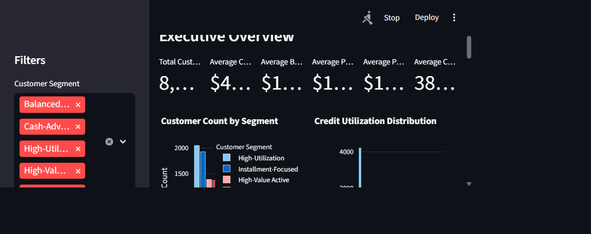
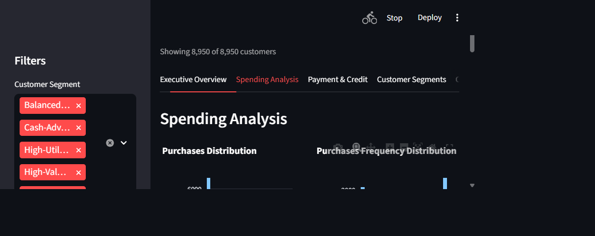
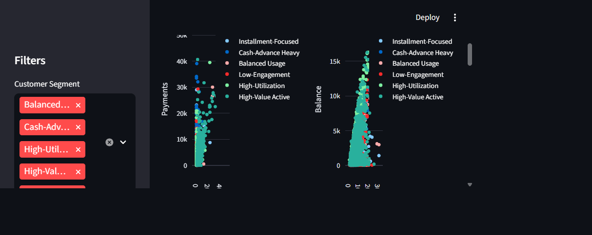
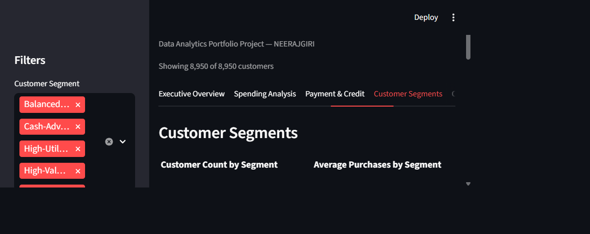
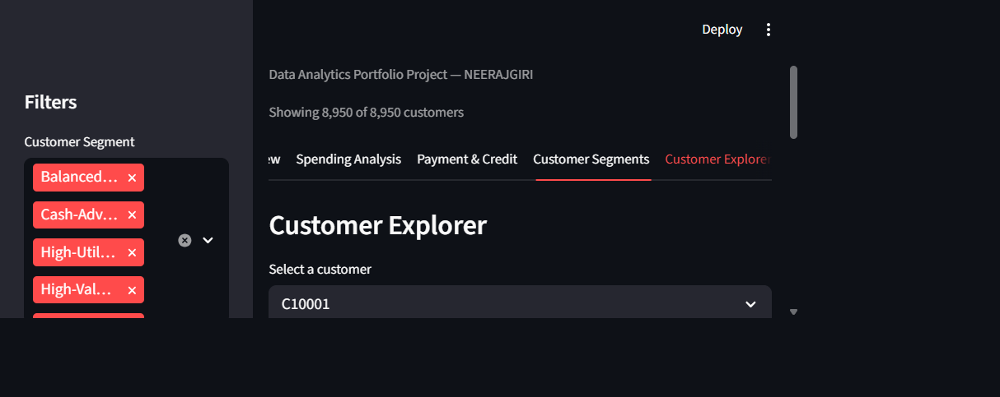
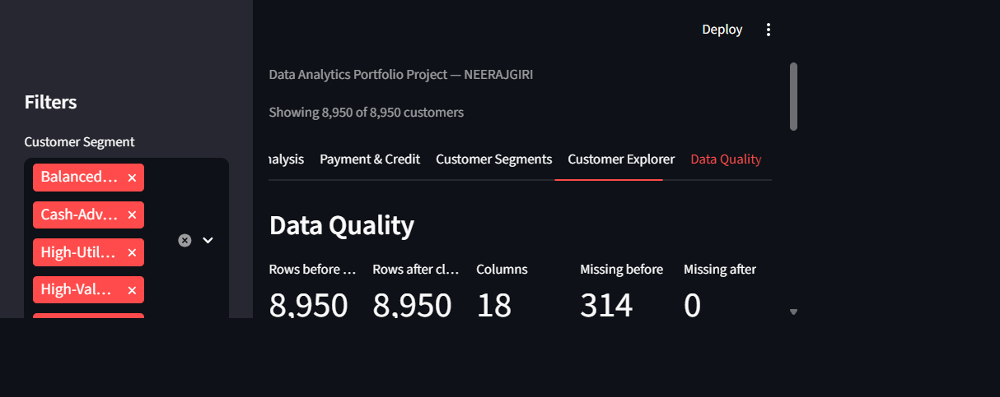

# Credit Card Customer & Financial Behavior Analytics

🔗 **Live Demo:** https://credit-card-behavior.streamlit.app

**Student:** NEERAJGIRI  
**Internship:** AICTE | IBM SkillsBuild Data Analytics with AI Internship 2026

---

## Project Overview

A Python and Streamlit data analytics project that turns customer-level credit card behavior into an interactive business analysis.

The project focuses on understanding customer spending, payment, credit utilization, cash-advance, and installment behavior through data cleaning, feature engineering, segmentation, visualization, and business-oriented analysis.

The complete workflow covers:

- Raw data inspection
- Data validation and cleaning
- Missing-value treatment
- Feature engineering
- Dynamic KPI calculation
- Rule-based customer segmentation
- Outlier detection
- Interactive data visualization
- Customer-level exploration
- Data-quality analysis
- Business insights and recommendations
- Automated project report generation

---

## Business Problem

Credit card portfolios contain customers with different spending, payment, utilization, cash-advance, and installment patterns.

A business analyst needs to understand these behavioral differences in order to identify meaningful customer patterns and potential areas for engagement and monitoring.

This project provides an interactive analytical dashboard that helps explore these patterns while avoiding unsupported credit, fraud, or customer-quality claims.

---

## Objectives

The main objectives of this project are:

- Verify the actual dataset structure and grain.
- Inspect data quality and identify missing or invalid values.
- Clean and prepare the dataset for analysis.
- Calculate meaningful financial behavior metrics.
- Create interpretable customer segments.
- Analyze spending, payment, utilization, and credit behavior.
- Identify unusual observations using IQR-based outlier analysis.
- Build an interactive Streamlit dashboard.
- Provide customer-level exploration through filters.
- Generate evidence-based business insights.
- Document limitations and potential future improvements.

---

## Dataset

This project uses Kaggle's **Credit Card Dataset for Clustering**.

The dataset contains customer-level credit card usage information such as:

- Credit limit
- Balance
- Purchases
- One-off purchases
- Installment purchases
- Cash advances
- Purchase frequency
- Cash-advance frequency
- Payments
- Minimum payments
- Full-payment behavior
- Tenure

### Dataset Source

[Kaggle – Credit Card Dataset for Clustering](https://www.kaggle.com/datasets/arjunbhasin2013/ccdata)

### Dataset Setup

The raw dataset is **not included in this GitHub repository**.

After downloading the dataset from Kaggle, place the CSV file locally at:

```text
data/raw/CC GENERAL.csv
```

The raw dataset is excluded from version control through `.gitignore`.

The processed dataset generated by the analysis is also excluded from version control because it is derived from the raw customer-level data.

> Note: Users are responsible for reviewing and complying with the dataset's applicable license and usage terms before downloading or redistributing it.

---

## Key Features

- Credit utilization ratio
- Payment ratio
- Purchase-to-credit-limit ratio
- Cash-advance intensity
- Average purchase transaction value
- Installment purchase share
- Rule-based customer segments
- IQR outlier flags that retain unusual but valid observations

---

## Technologies Used

Python, Pandas, NumPy, Matplotlib, Seaborn, Plotly, Streamlit, and python-docx.

---

## Project Architecture

```text
raw CSV -> loading and validation -> cleaning -> feature engineering
       -> KPIs and segments -> Plotly visualizations -> Streamlit dashboard
       -> business insights and DOCX report
```

---

## Data Cleaning

- Exact duplicate rows are removed if present.
- Numeric fields are parsed with defensive conversion.
- Missing `CREDIT_LIMIT` and `MINIMUM_PAYMENTS` values are imputed with observed medians.
- Negative financial values are checked and clipped to zero only if encountered.
- Extreme values are retained and reported through IQR thresholds rather than blindly removed.

---

## KPIs

The dashboard calculates total customers, average and median credit limit, average balance, purchases, payments, cash advance, purchase frequency, utilization, tenure, and full-payment percentage dynamically from the active filtered data.

---

## Customer Segmentation

The rule-based labels are:

- High-Value Active
- High-Utilization
- Cash-Advance Heavy
- Installment-Focused
- Low-Engagement
- Balanced Usage

These are relative analytical groupings, not credit decisions or customer quality labels.

---

## Dashboard

The application contains six tabs:

1. Executive Overview
2. Spending Analysis
3. Payment & Credit
4. Customer Segments
5. Customer Explorer
6. Data Quality

Sidebar filters update the displayed KPIs, charts, tables, and insights.

---

## Screenshots













---

## Key Insights

The dashboard generates insights from the selected data, including the largest segment, utilization percentile share, zero-purchase share, and the observed purchases-to-credit-limit correlation. Results are never hard-coded.

---

## Business Recommendations

- Use segment profiles to prioritize engagement experiments.
- Review utilization and payment behavior together.
- Investigate cash-advance-heavy patterns with appropriate context.
- Monitor changes over time before making operational decisions.
- Avoid interpreting descriptive correlations as causal evidence.

---

## Installation

```bash
python -m venv .venv
# Windows PowerShell
.venv\Scripts\Activate.ps1
pip install -r requirements.txt
```

---

## How to Run

### 1. Clone the repository

```bash
git clone https://github.com/<your-username>/credit-card-customer-financial-behavior-analytics.git
cd credit-card-customer-financial-behavior-analytics
```

### 2. Add the dataset

1. Download the Kaggle CSV manually.
2. Place it at `data/raw/CC GENERAL.csv`.

### 3. Start the dashboard

```bash
streamlit run NEERAJGIRI_CreditCardCustomerFinancialAnalytics.py
```

### 4. Generate the project report (optional)

To generate the project report after installing `python-docx`:

```bash
python NEERAJGIRI_CreditCardCustomerFinancialAnalytics.py --generate-report
```

---

## Project Structure

```text
.
├── NEERAJGIRI_CreditCardCustomerFinancialAnalytics.py
├── NEERAJGIRI_CreditCardCustomerFinancialAnalytics_ProjectReport.docx
├── requirements.txt
├── README.md
├── .gitignore
├── data/
│   ├── raw/              # Local only - dataset not committed
│   └── processed/        # Local only - generated data not committed
├── report_assets/
│   ├── architecture.png
│   ├── balance.png
│   ├── cash_advance.png
│   ├── correlation.png
│   ├── credit_limit.png
│   ├── full_payment.png
│   ├── purchases_limit.png
│   ├── purchases.png
│   └── utilization.png
└── screenshots/
    ├── 01_executive_overview.png
    ├── 02_spending_analysis.png
    ├── 03_payment_credit.png
    ├── 04_customer_segments.png
    ├── 05_customer_explorer.png
    └── 06_data_quality.png
```

---

## Limitations

The dataset is a historical snapshot without timestamps, demographic context, outcome labels, or a causal design. Segment rules are portfolio-relative and missing-value imputation introduces uncertainty.

---

## Future Improvements

Add time-series data, validated business thresholds, model monitoring, optional clustering comparison, automated tests, and controlled deployment with access governance.